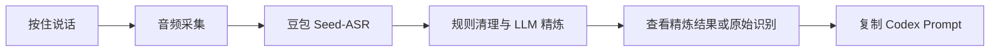

# VoiceHub / 语枢

[](https://github.com/yuquan679297-sketch/Cloudyuquan/actions/workflows/ci.yml)
[](LICENSE)

[English](README.md) | [简体中文](README.zh-CN.md)

> 将中文开发语音整理为可直接交给 Codex 的结构化 Prompt。

VoiceHub / 语枢是一款面向中文开发者的 macOS 桌面应用。你按住按钮说出开发需求，松开后应用会完成语音识别和 Prompt 精炼；确认内容无误后，再复制到 Codex 或你的编码工作流中。

项目刻意保留人工确认这一步：VoiceHub 负责整理和复制 Prompt，不会自动向 Codex、IDE 或其他应用粘贴内容，也不会远程控制其他应用。

## 目录

- 为什么需要 VoiceHub
- 核心流程
- 功能特性
- 运行环境
- 快速开始
- 配置说明
- 日常使用
- 开发与验证
- 隐私与安全
- 当前范围与路线图
- 参与贡献
- 开源协议

## 为什么需要 VoiceHub

语音表达很快，但原始口述往往不够完整，直接交给编码助手时容易遗漏目标、约束或验收标准。VoiceHub 会把类似“帮我查一下页面白屏，别重构，给最小修复”的请求，整理为包含任务、上下文、约束和完成条件的聚焦 Prompt。

它适合希望继续使用现有编辑器和 Codex 工作流，但想减少“想到需求”到“写出清晰指令”之间摩擦的开发者。

## 核心流程



## 功能特性

- 按住说话录音，提供实时音量反馈和工作流状态提示。
- 基于豆包 Seed-ASR 的语音转文字，可配置 Endpoint 和 Resource ID。
- 先进行快速规则清理，再使用可配置 LLM 精炼开发指令。
- 支持 OpenAI Chat Completions、OpenAI Responses 和 Anthropic Messages 协议。
- 支持精炼结果与原始识别切换、Markdown 预览、编辑以及复制状态反馈。
- 支持自动复制开关和本地最近 Prompt 历史。
- 支持 macOS 全局键盘快捷键或鼠标触发键。
- 配置抽屉集中展示 ASR、LLM、快捷键、剪贴板和诊断状态。
- 在应用内保存配置后，API Key 会写入 macOS Keychain。

## 运行环境

- macOS
- Node.js 20 LTS 或更高版本
- Rust stable 工具链
- Xcode Command Line Tools
- 你自己的 ASR 和 LLM 服务商凭据

VoiceHub 会调用你自行配置的 ASR 和 LLM 服务。服务可用性、计费和数据处理规则由对应服务商决定，与本仓库相互独立。

## 快速开始

```bash
git clone https://github.com/yuquan679297-sketch/Cloudyuquan.git
cd Cloudyuquan
npm ci
cp .voicehub.dev.example.json .voicehub.dev.json
npm run tauri dev
```

将自己的本地凭据填入 `.voicehub.dev.json`，或者启动应用后在配置抽屉中填写。这个本地配置文件已被 Git 忽略，绝不能提交到仓库。

字段含义、首次配置和常见故障排查见[配置指南](docs/configuration.md)。

## 配置说明

VoiceHub 需要两类服务：

1. ASR 服务，用于把语音转换为文本。当前实现面向豆包 Seed-ASR。
2. LLM 服务，用于把原始文本整理成结构化开发 Prompt。

仓库中的[开发配置示例](.voicehub.dev.example.json)只包含占位符。请只在本地填写真实 Key，绝不要提交到 Git。

运行时配置规则：

- 通过应用保存的 API Key 存放在 macOS Keychain。
- Endpoint、模型名、协议等非敏感字段存放在应用配置目录。
- 当持久化运行时配置不存在时，`.voicehub.dev.json` 会作为本地开发的回退配置。

## 日常使用

1. 从顶部状态区打开配置抽屉，完成 ASR 和 LLM 设置。
2. 按住主录音按钮，或按住已配置的全局触发键，说出开发需求。
3. 松开后等待识别和精炼完成。
4. 默认查看精炼 Prompt；需要核对原话时可切换到原始识别。
5. 手动复制结果，或在确认符合工作习惯后开启自动复制。

最近 Prompt 只保存在本机，不会同步到云端。

## 开发与验证

安装依赖并启动桌面应用：

```bash
npm ci
npm run tauri dev
```

运行本地开发和 GitHub Actions 使用的检查：

```bash
npm run test:frontend
npm run build
```

项目使用 Tauri 2，前端为 React 与 TypeScript，后端为 Rust。完整处理链路和产品边界见 [ARCHITECTURE.md](ARCHITECTURE.md)。

## 隐私与安全

- 不要在 Issue、PR、截图、日志或 Git 提交中包含 API Key、Access Token、密码或真实语音内容。
- `.voicehub.dev.json`、`.env`、依赖目录和构建产物已被 Git 忽略。
- 分享日志前请先移除凭据和可识别个人身份的信息。
- 发现安全问题时，请遵循 [SECURITY.md](SECURITY.md)，不要在公开 Issue 中披露敏感细节。

## 当前范围与路线图

当前已覆盖：

- 面向中文开发请求的 macOS 桌面工作流。
- ASR、LLM 精炼、本地历史、诊断和剪贴板交接。
- 在用户确认后复制 Codex 可用 Prompt。

当前不提供：

- 已接入正式工作流的离线 ASR 方案。
- 自动粘贴、IDE 控制或跨应用远程控制。
- 云同步、团队共享 Prompt 库或管理后台。
- 已签名、已公证、可直接下载安装的 macOS 发布包。

后续版本应优先提升稳定性、配置清晰度和可复现的桌面打包能力，再考虑增加新的集成。

## 参与贡献

欢迎提交 Issue 和 Pull Request。提交改动前请阅读 [CONTRIBUTING.md](CONTRIBUTING.md)，并使用 Issue 表单提供可复现信息，同时避免包含任何敏感内容。

## 开源协议

VoiceHub 使用 [MIT License](LICENSE) 开源。
